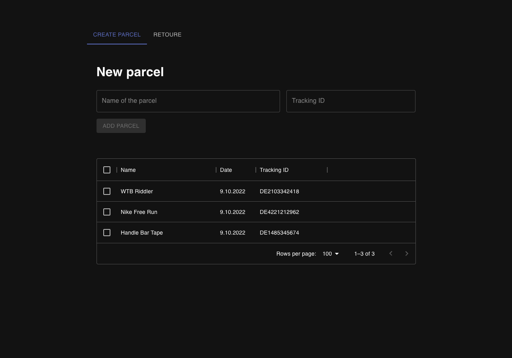

# Parcel Management

This app helps you to organize  and remind you about your current orders and retoure processes.

## Setup firebase
To store your orders you`ll have to setup firebase to use this app. The configuration file should look like this:

##
```
{
    apiKey: 'API_KEY',
    authDomain: 'AUTH_DOMAIN_URL',
    databaseURL: 'DATABASE_URL',
    projectId: 'PROJECT_ID',
    storageBucket: 'STORAGE_BUCKET_URL',
    messagingSenderId: 'MESSAGING_SENDER_ID',
    appId: 'APP_ID',
};
```
## Start the app
### `yarn start`

## Run the tests
`yarn test`

